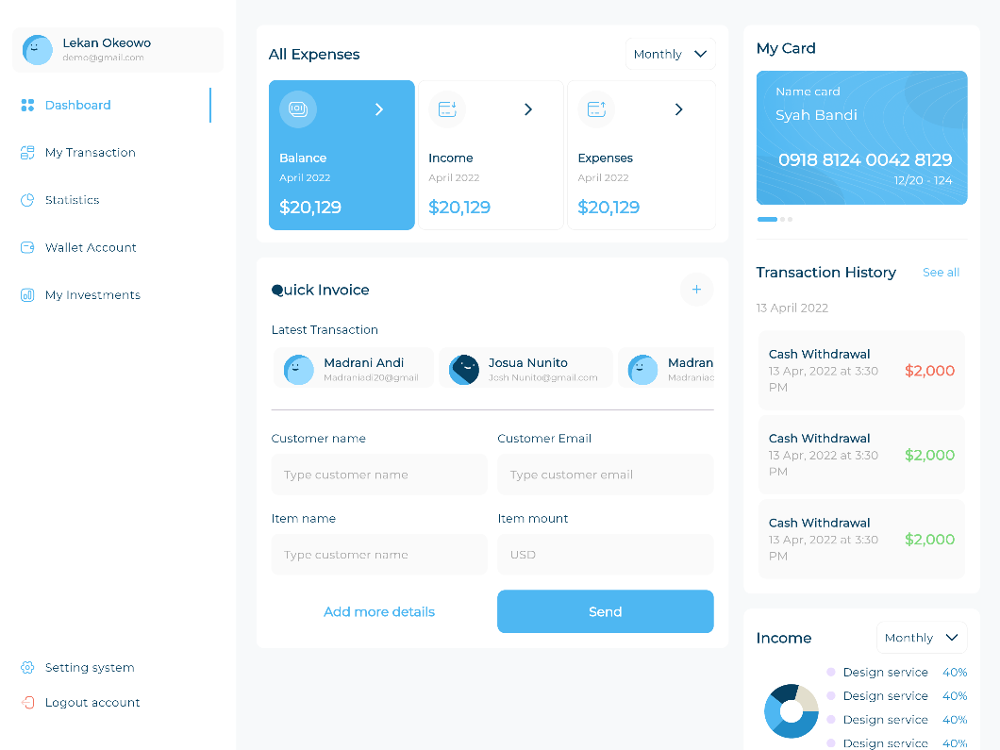
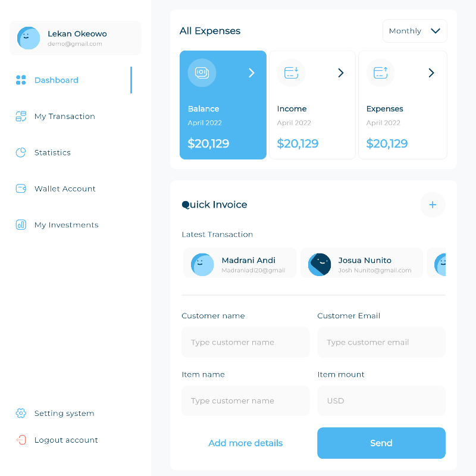
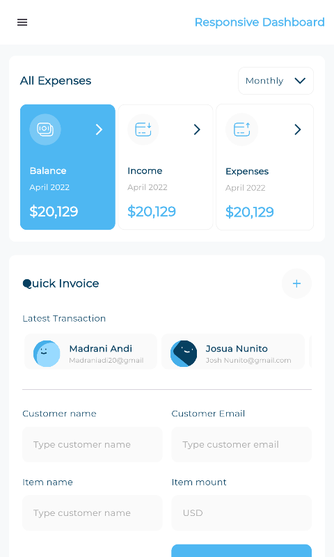

# 📱 Flutter Advanced Responsive & Adaptive Admin Dashboard

A comprehensive, production-ready educational repository focused on building professional **Responsive** (fluid across viewports) and **Adaptive** (native to host platforms) User Interfaces in Flutter. 

This project bridges the gap between high-fidelity UI design and structural front-end engineering, translating complex responsive dashboard layouts into modular, pixel-perfect Flutter code.

---

## 🔗 Project References

* **Educational Course:** Built following the advanced layout principles from the course [Mastering Flutter: Responsive & Adaptive UI Design (Arabic)](www.udemy.com/course/mastering-flutter-responsive-adaptive-ui-design-arabic/) on Udemy by Instructor **Tharwat Samy**.
* **UI/UX Design Spec:** Developed directly from this professional [Figma Admin Dashboard Design Community Template](https://www.figma.com/design/MaVFj6GIkC4oUYj6DYx4E8/Admin-Dashboard--Community-?m=auto&t=uZIzSIKxX7bEo2pZ-6).

---

## 📸 Application Showcases

Experience how the layout intelligently scales and updates navigation structures from desktop panels down to compact mobile drawers:

| 🖥️ Desktop Dashboard View | 📑 Tablet Workspace View | 📱 Mobile Interface View |
| :---: | :---: | :---: |
|  |  |  |

> 💡 **Tip for Reviewers:** If you are checking this locally on Git, you can replace the placeholder paths inside the `assets/` directory with your actual simulator snapshots to see your code execution screens above.

---

## 🛠️ Architecture & Responsive Breakpoints

To maintain clean code separation, the project follows a **Feature-First Clean Folder Structure**. Responsive boundaries are handled globally using custom layouts based on strict screen-width rules:

```text
lib/
├── core/
│   │
│   │
│   └── utils/
│       └── size_config.dart       <-- Helper for dynamic layout constrains scaling
│       └── app_styles.dart        <-- Helper for dynamic text font size scaling
├── features/
│   └── dashboard/
│       ├── presentation/
│       │   ├── view_model/
│       │   └── views/
│       │       ├── responsive_layout.dart  <-- Main structural switcher
│       │       └── widgets/
│       │           ├── dashboard_desktop_layout.dart
│       │           ├── dashboard_tablet_layout.dart
│       │           └── dashboard_mobile_layout.dart
└── main.dart
```

### 📐 Implemented Viewport Breakpoints
* **Mobile Viewport:** `width < 600` (Switches to bottom bars or hamburger drawers).
* **Tablet Viewport:** `600 <= width < 1200` (Conditionally exhibits simplified SideNav icons).
* **Desktop Viewport:** `width >= 1200` (Expanded multi-pane layouts with pinning options).

---

## 💻 Core Technical Implementations

Here is a look at the production-level code implementations that form the core structural layout switcher of this dashboard:

### 1. The Responsive Layout Engine
```dart
import 'package:flutter/material.dart';
import '../constants/app_breakpoints.dart';

class AdaptiveLayoutWidget extends StatelessWidget {
  final Widget mobileLayout;
  final Widget tabletLayout;
  final Widget desktopLayout;

  const AdaptiveLayoutWidget({
    super.key,
    required this.mobileLayout,
    required this.tabletLayout,
    required this.desktopLayout,
  });

  @override
  Widget build(BuildContext context) {
    return LayoutBuilder(
      builder: (context, constraints) {
        if (constraints.maxWidth <= SizeConfig.mobile) {
          return mobile;
        } else if (constraints.maxWidth <= SizeConfig.tablet) {
          return tabletLayout;
        } else {
          return desktopLayout;
        }
      },
    );
  }
}
```

### 2. Adaptive Framework Highlights
* **`MediaQuery` vs `LayoutBuilder`:** Used `MediaQuery` for full screen-level attributes (orientation and density) while utilizing `LayoutBuilder` inside layout trees for independent local widget constraint management.
* **No-Overflow Flex System:** Wrapped dynamic data tables and dashboard analytic cards inside combinations of `Expanded`, `Flexible`, and `CustomScrollView` (`Slivers`) to achieve flawless rendering profiles.

---

## 🚀 Installation & Local Environment Setup

Follow these commands to deploy, configure, and review this system locally on your development machine:

1. **Clone the Repository:**
   ```bash
   git clone https://github.com/osama-alsharabi/Responsive-Dashboard.git
   cd Responsive-Dashboard
   ```

2. **Verify Dependencies and Flutter SDK:**
   Ensure you have your Flutter environment installed (`flutter doctor`). Then fetch the packages:
   ```bash
   flutter pub get
   ```

3. **Run Code Generation (If using local models/localization packages):**
   ```bash
   flutter pub run build_runner build --delete-conflicting-outputs
   ```

4. **Execute on Specific Target Devices:**
   * **To test desktop constraints:**
     ```bash
     flutter run -d windows # Or macos / linux
     ```
   * **To test web responsive scaling:**
     ```bash
     flutter run -d chrome
     ```

---

## 🤝 Key Technical Takeaways

By working through this codebase, deep familiarity was built with:
- [x] Avoiding strict UI pixel values; leveraging aspect ratios and sizing weights instead.
- [x] Utilizing adaptive themes to swap between Material and Cupertino styling paradigms natively.
- [x] Structuring complex nested scrolling grids for modern administrative operational software.
